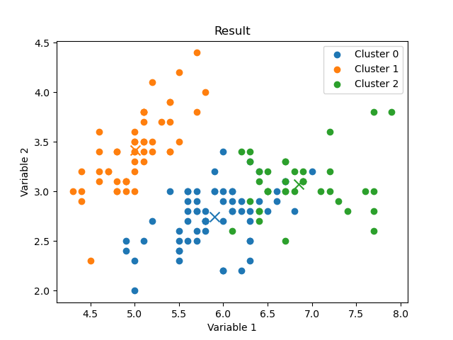

# TC1002s
Código y guías para el reto de Semana Tec TC1002s

En este repositorio encontrar la ayuda para una implementación del algoritmo Kmeans con numpy.

### Resultados

#### Figure: this text is ignored {#figure1}

{#figA width=45%}\
{#figB width=45%}
{#figC width=45%}
{#figD width=45%}

Caption: Ejemplo de ejecución en Iris
